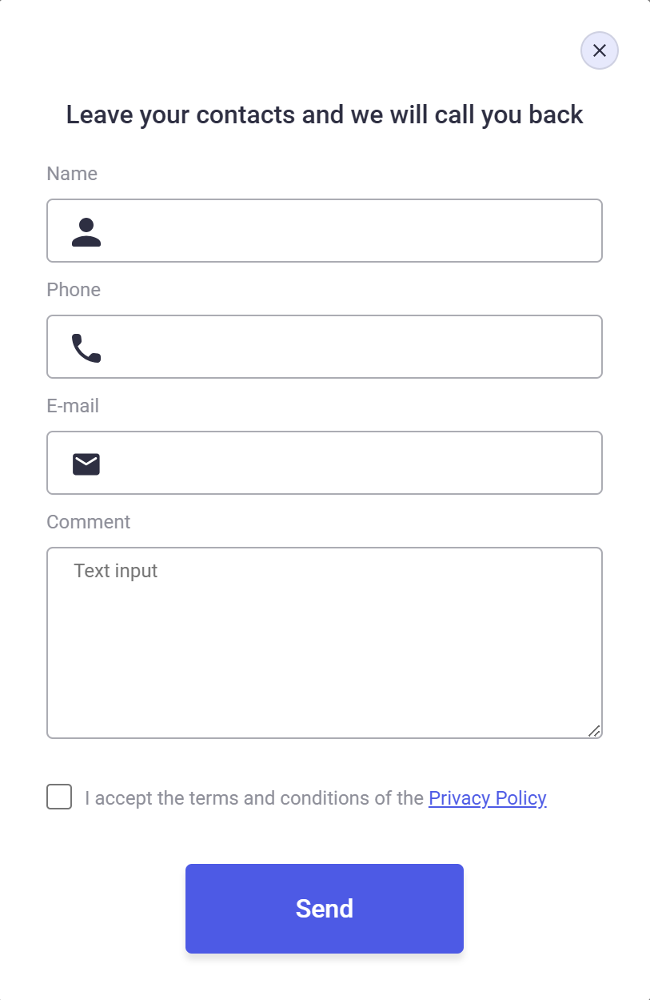

# 🌐 WebStudio Project — Modal & Forms Implementation

This project was created as part of my **HTML & CSS homework (HW-05)**.  
The goal was to complete the **modal window** and **form design** tasks from the Figma layout, following semantic structure, accessibility, and design transition requirements.

---

## 🚀 Live Demo

👉 [GitHub Pages Link](https://halenurgurel.github.io/goit-markup-hw-05/)

---

## 📂 Project Structure

```

goit-markup-hw-05/
│── index.html
│── styles.css
│── images/
│ ├── icons.svg
│ ├── hero-background.png
│ ├── mark.jpg
│ ├── tom.jpg
│ ├── camila.jpg
│ ├── daniel.jpg
│ ├── banking-app.jpg
│ ├── cashless-payment.jpg
│ ├── meditation-app.jpg
│ ├── taxi-service.jpg
│ ├── screen-illustrators.jpg
│ ├── online-courses.jpg
│ ├── preview-modal.png
│ └── preview-form.png
│── README.md


```

---

## ✅ Requirements Checklist

### 🪟 Modal Window

| Requirement                                                | Status |
| ---------------------------------------------------------- | ------ |
| Backdrop (dark transparent background) styled and designed | ✅     |
| Backdrop covers 100% of viewport width and height          | ✅     |
| Modal window layout and styling completed                  | ✅     |
| Modal centered vertically & horizontally                   | ✅     |
| Close button (top-right corner) designed with SVG icon     | ✅     |
| Modal hidden by default                                    | ✅     |
| Modal becomes visible when `.is-open` class is added       | ✅     |

---

### 🧾 Forms

| Requirement                                        | Status |
| -------------------------------------------------- | ------ |
| All layout elements marked up in HTML              | ✅     |
| Semantic tags used correctly                       | ✅     |
| Newsletter subscription form in footer implemented | ✅     |
| Application form inside modal implemented          | ✅     |
| Every input has a `name` attribute                 | ✅     |
| `name` values clearly describe the input function  | ✅     |
| Each input connected to a `<label>` element        | ✅     |
| Placeholders used for hint text where required     | ✅     |
| Newsletter input includes `placeholder="E-mail"`   | ✅     |
| Submit buttons have `type="submit"`                | ✅     |
| All new form icons added to `icons.svg` sprite     | ✅     |

---

### 🎨 Design & Interaction

| Requirement                                                                     | Status |
| ------------------------------------------------------------------------------- | ------ |
| Newsletter form elements in footer styled                                       | ✅     |
| Modal form elements styled                                                      | ✅     |
| Inputs & icons change color on focus (`#404bbf`)                                | ✅     |
| Default browser checkbox visually hidden                                        | ✅     |
| Checkbox replaced by custom SVG tick icon                                       | ✅     |
| All hover/focus effects have transitions (`250ms cubic-bezier(0.4, 0, 0.2, 1)`) | ✅     |

---

## 🧱 Semantic HTML & Accessibility

- Semantic structure: `header`, `main`, `section`, `nav`, `footer`
- All forms labeled with `<label>` elements for accessibility
- Social icons include `aria-label`
- Modal and forms designed with keyboard and focus usability in mind
- All icons embedded with `<svg><use href="./images/icons.svg#id"></use></svg>`

---

## 🖼️ Visual Preview

| Modal Window                                 | Footer Form                                |
| -------------------------------------------- | ------------------------------------------ |
|  |  |

---

## 🛠️ Tools & Technologies

| Tool                 | Purpose                               |
| -------------------- | ------------------------------------- |
| **Figma**            | Design reference                      |
| **IcoMoon / SVGOMG** | Icon optimization & sprite generation |
| **Squoosh**          | Image compression                     |
| **Prettier**         | Code formatting                       |
| **VS Code**          | Development environment               |
| **W3C Validator**    | HTML validation                       |
| **GitHub Pages**     | Deployment                            |

---

## ⚙️ Technical Notes

- All icons are combined into a single `icons.svg` sprite.
- SVG fills are controlled via CSS using the `fill` property for focus and hover effects.
- The modal uses `.is-open` to toggle visibility with `display: flex`.
- `:focus-within` pseudo-class used to detect focus on input fields and change both **border** and **SVG icon color** dynamically.
- Transitions applied to all interactive elements for a smooth visual effect.

---

## 👩‍💻 Author

**Halenur Gürel**  
Homework project – _Modal Window & Forms implementation for WebStudio layout_  
📍 HTML5 · CSS3 · Responsive Design · Accessibility · SVG Sprite  
🔗 [GitHub Profile](https://github.com/halenurgurel)
